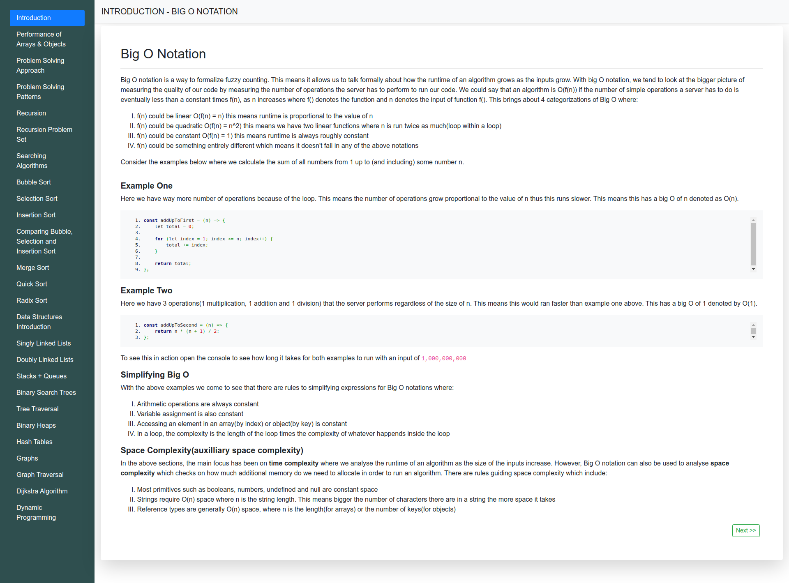

## About

### Brief

This repo is a collection of my notes on the various topics in Data Structures and Algorithms. The examples are in JavaScript.

### Setup

Simply:
- Clone the repo 

```
git clone https://github.com/PeterKitonga/dsalgo.git
```
- Navigate to the project and click on the `index.html` file of a lesson

### Illustration


### Tutorial
Visit [Udemy](https://www.udemy.com/course/js-algorithms-and-data-structures-masterclass) for the tutorial